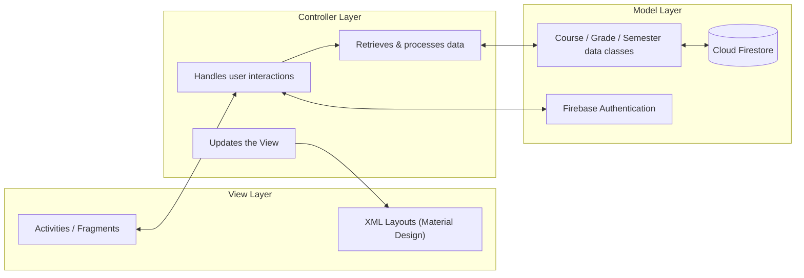
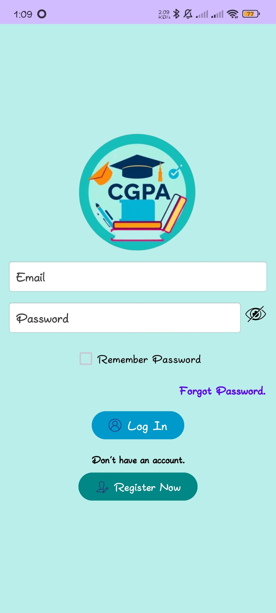
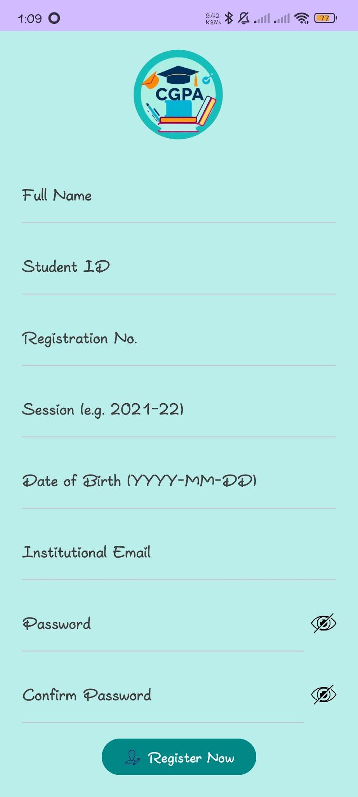
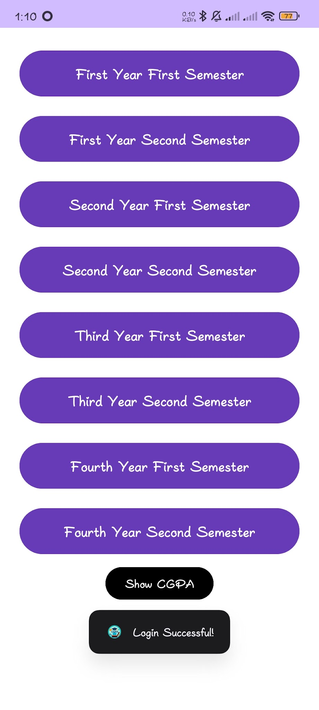
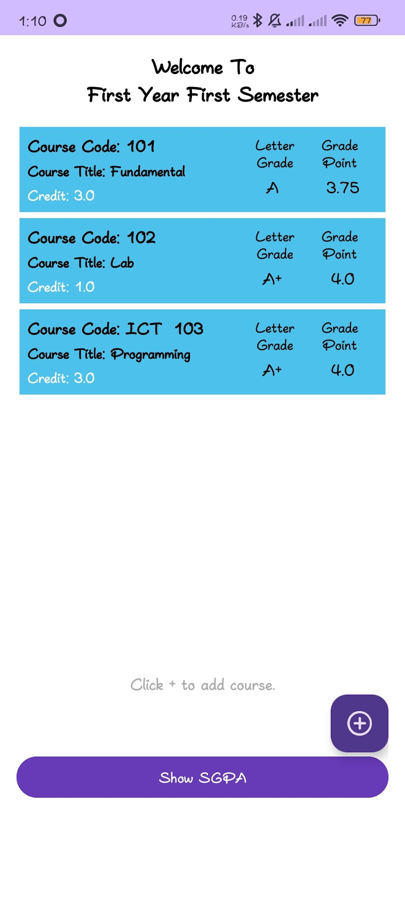
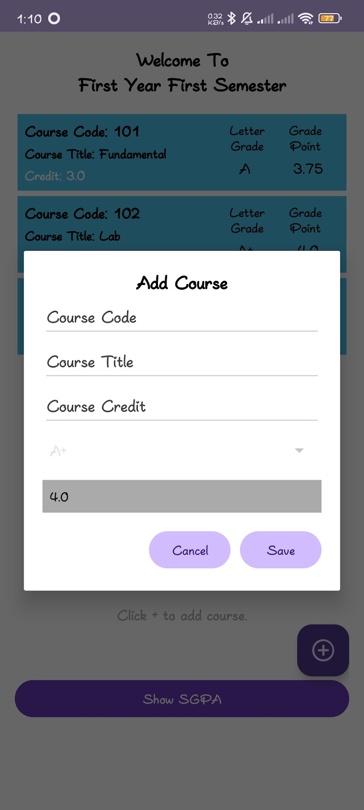
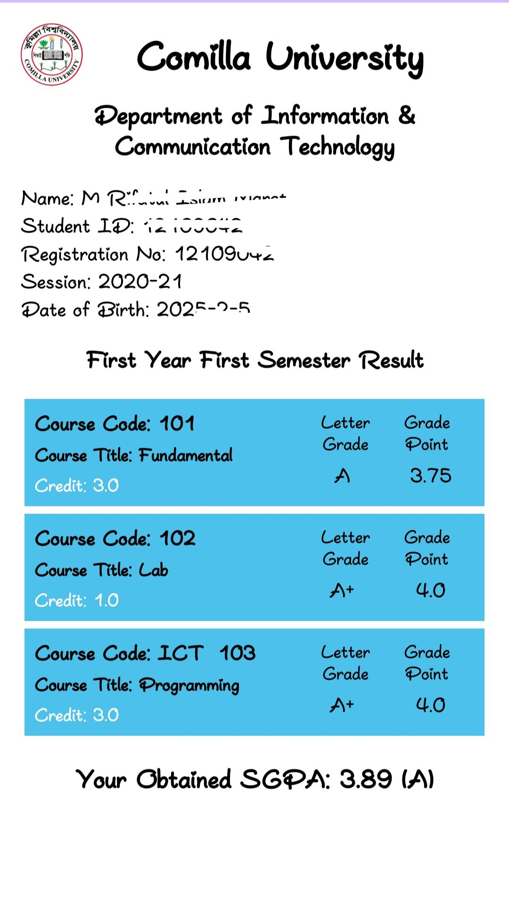
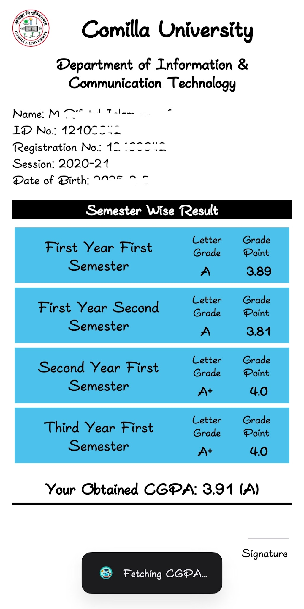

<div align="center">

# 🎓 CGPA Calculator

**An Android application for calculating and tracking SGPA & CGPA with real-time cloud sync**


</div>

---

## 📖 Overview

**CGPA Calculator** is a native Android application built to simplify Semester Grade Point Average (SGPA) and Cumulative Grade Point Average (CGPA) calculation for university students. Instead of manually computing grades with pen and paper, students can enter their course names, credit hours, and grades, and the app automatically computes accurate SGPA/CGPA values.

Beyond calculation, the app stores each semester's results in the cloud, letting students look back at past semesters and visualize their academic progress over time — turning a repetitive manual task into a fast, reliable, and error-free process.

This repository contains the full Android Studio source code for the application. A detailed academic project report covering the methodology, system design, and evaluation is linked below.

📄 **Full Project Report:** [CGPA Calculator Android Application — Project Report (ResearchGate)](https://www.researchgate.net/profile/Mohammad-Rifatul-Islam-Marof/publication/389778161_Project_Report_on_CGPA_Calculator_Android_Application/links/67d1a50bcc055043ce70ddd2/Project-Report-on-CGPA-Calculator-Android-Application.pdf)

---

## ✨ Features

- 🔐 **Secure Authentication** — Sign up and log in via Firebase Authentication
- ➕ **Course Entry** — Add course name, credit hours, and grade for each semester
- 🧮 **Automatic SGPA/CGPA Calculation** — Real-time, accurate computation based on the university's grading system
- ☁️ **Cloud Sync** — Semester results are saved and retrieved from Cloud Firestore, accessible across sessions
- 📊 **Progress Tracking** — Stores historical semester data so students can visualize performance trends over time
- 🎨 **Material Design UI** — Clean, intuitive interface following Material Design principles
- ✅ **Input Validation & Error Handling** — Dedicated error-handling module prevents invalid entries and crashes
- 🔙 **Smooth Navigation** — Refined back-button behavior for a consistent user experience

---

## 🛠️ Tech Stack

| Layer | Technology |
|---|---|
| **Language** | Java |
| **Platform** | Android (native) |
| **UI** | Android XML layouts, Material Design Components |
| **Architecture** | MVC (Model–View–Controller) |
| **Database** | Cloud Firestore (Firebase) |
| **Authentication** | Firebase Authentication |
| **Serverless Logic** | Firebase Cloud Functions (`functions/`) |
| **Build System** | Gradle (Kotlin DSL — `build.gradle.kts`) |
| **IDE** | Android Studio |

---

## 🏗️ System Architecture

The application follows an **MVC (Model–View–Controller)** pattern, keeping UI, business logic, and data access cleanly separated:



- **View** — Activities/Fragments and Material Design layouts that render the UI
- **Controller** — Manages user interactions, retrieves data from the Model, and updates the View accordingly
- **Model** — Represents course/grade data and communicates with Firebase (Firestore for data, Authentication for secure access)

---

## 🔄 Application Process Flow



## 🔄 Flowchart


**Calculation logic:**
1. For every course, multiply the grade point by its credit hours.
2. Sum these values across all courses in the semester, then divide by the total credit hours → **SGPA**.
3. Combine the new semester's grade points and credits with the previously stored CGPA and total credits → updated **CGPA**.
4. Results are validated, persisted to Firestore, and reflected instantly in the UI and historical trend view.

---

## 🎨 UI / App Screens

| Home | Registration | Dashboard |
|---|---|---|
|  |  |  |

| Semester | Add Course |
|---|---|
|  |  |

| SGPA | CGPA |
|---|---|
|  |  |

---

## 🚀 Getting Started

### Prerequisites
- [Android Studio](https://developer.android.com/studio) (latest stable)
- JDK 11+
- A Firebase project (Firestore + Authentication enabled)

### Setup
```bash
# 1. Clone the repository
git clone https://github.com/rifat-cou/CGPACalculator.git
cd CGPACalculator

# 2. Open in Android Studio
# File > Open > select the cloned folder
```

3. **Connect Firebase**
   - Create a project in the [Firebase Console](https://console.firebase.google.com/).
   - Enable **Authentication** (Email/Password or your preferred provider) and **Cloud Firestore**.
   - Download your `google-services.json` and place it inside the `app/` directory.
   - Confirm `.firebaserc` and `firebase.json` point to your Firebase project ID.

4. **Build & Run**
   ```bash
   ./gradlew assembleDebug
   ```
   Or simply hit **Run ▶** in Android Studio.

---

## 📁 Project Structure

```
CGPACalculator/
├── app/                 # Android application source (Java, layouts, resources)
├── functions/           # Firebase Cloud Functions
├── gradle/              # Gradle wrapper files
├── docs/                # Screenshots, flowchart exports, demo video (add your own)
├── build.gradle.kts     # Root Gradle build script
├── settings.gradle.kts  # Gradle project settings
├── firebase.json        # Firebase project configuration
├── .firebaserc          # Firebase project aliasing
├── README.md
├── CONTRIBUTING.md
└── LICENSE
```

---

## 🤝 Contributing

Contributions, bug reports, and feature suggestions are welcome! Please see [CONTRIBUTING.md](CONTRIBUTING.md) for guidelines before opening an issue or pull request.

---

## 📜 License

This project is licensed under the [MIT License](LICENSE).

---

## 👤 Author

**Mohammad Rifatul Islam Marof**
ICT Graduate, Comilla University
📄 [Project Report on ResearchGate](https://www.researchgate.net/profile/Mohammad-Rifatul-Islam-Marof/publication/389778161_Project_Report_on_CGPA_Calculator_Android_Application/links/67d1a50bcc055043ce70ddd2/Project-Report-on-CGPA-Calculator-Android-Application.pdf)
🔗 [GitHub](https://github.com/rifat-cou)
